# DevForge Architecture

> 76 files, ~26,000 lines of Lua.
> Bundled libraries: LibStub, LibDeflate, LibSerialize (for WA import decoding).
> No Ace3 or external frameworks.

---

## High-Level Architecture

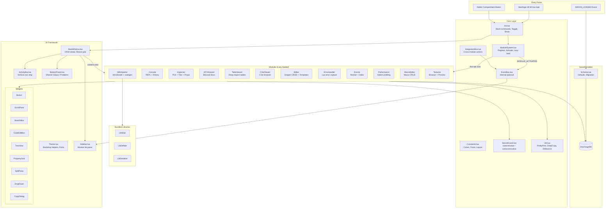

---

## Load Order & Boot Sequence

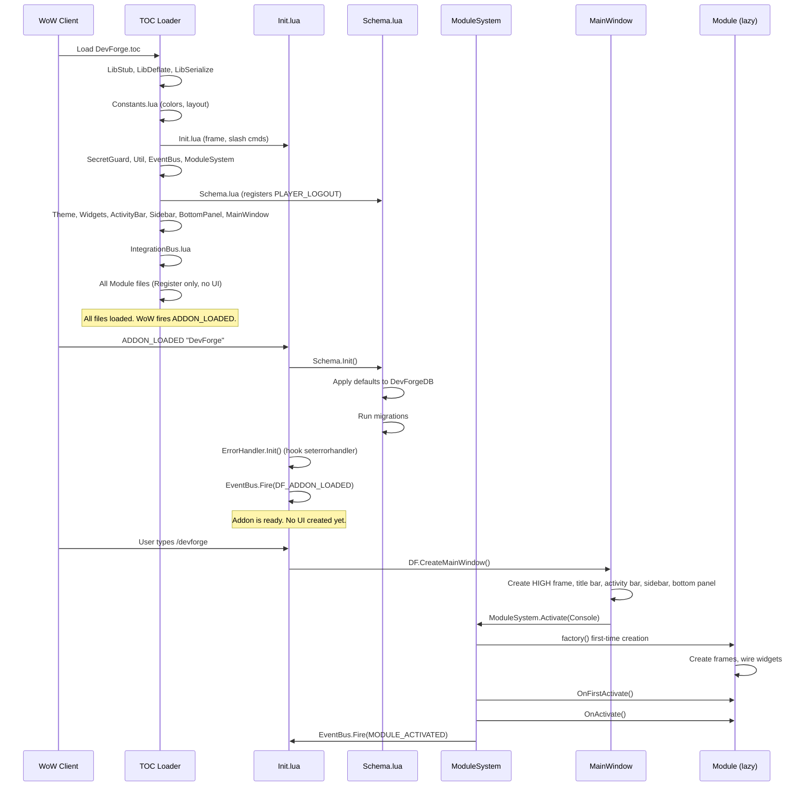

---

## Module Lifecycle

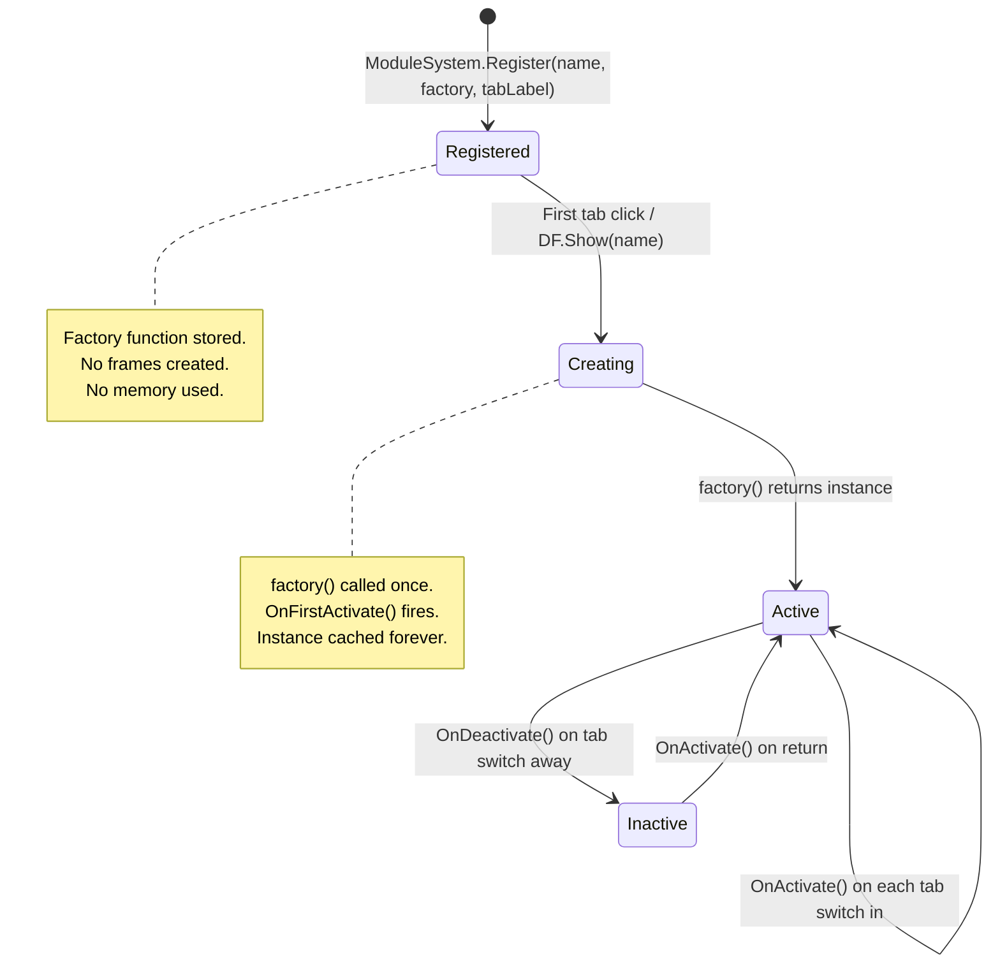

### Module Registry

| Internal Name    | Tab Label    | Slash Command         | Files |
|------------------|--------------|-----------------------|-------|
| `ErrorHandler`   | Errors       | `/df errors`, `/dl`   | 4     |
| `Console`        | Console      | `/df console`, `/lua` | 5     |
| `Inspector`      | Inspector    | `/df inspect`, `/df pick` | 6  |
| `APIBrowser`     | API Browser  | `/df api`, `/apii`    | 5     |
| `TableViewer`    | Tables       | (via IntegrationBus)  | 2     |
| `CVarViewer`     | CVars        | (via sidebar)         | 2     |
| `SnippetEditor`  | Editor       | `/df editor`          | 7     |
| `WAImporter`     | WA Import    | (via Editor scaffold) | 3     |
| `EventMonitor`   | Events       | `/df events`          | 4     |
| `Performance`    | Perf         | `/df perf`            | 3     |
| `MacroEditor`    | Macros       | `/df macros`          | 3     |
| `TextureBrowser` | Textures     | `/df textures`        | 5     |

---

## Console Execution Flow

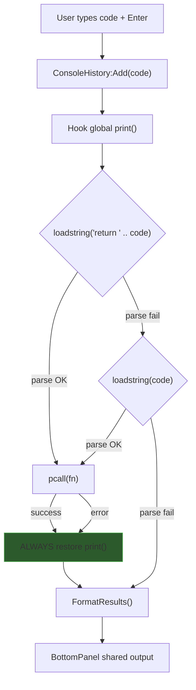

### Print Capture Safety

```
origPrint = print
print = capture_function
    DoExecute()      -- wrapped in pcall
print = origPrint    -- ALWAYS runs, even on internal error
```

---

## Inspector Data Flow

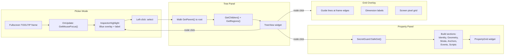

### Secret Value Handling

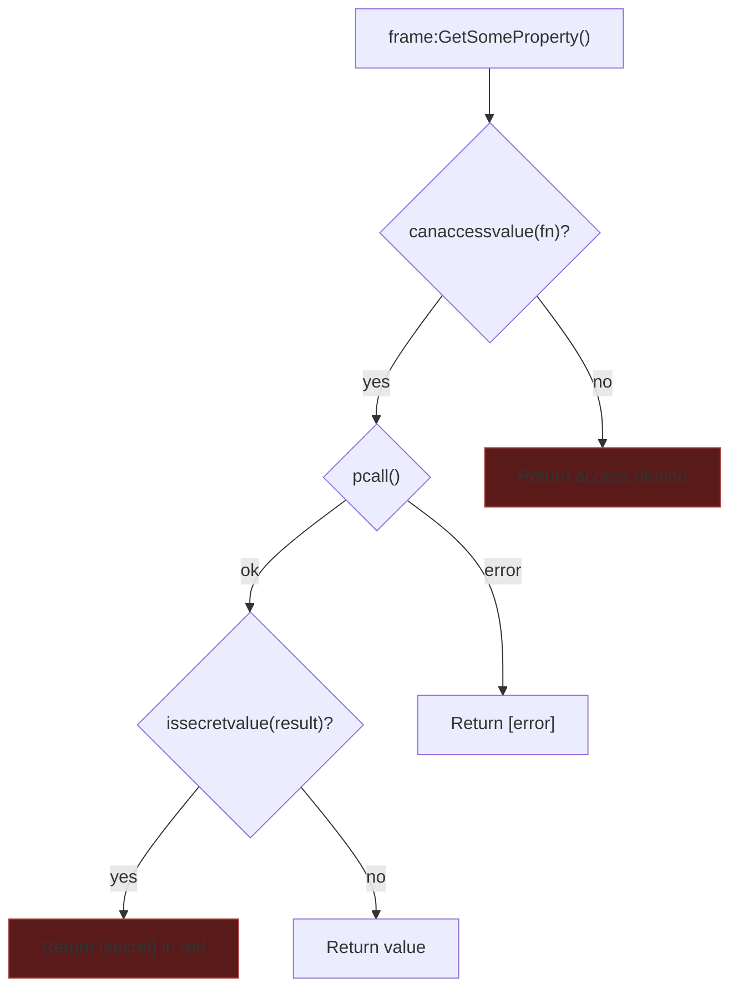

---

## API Browser Data Pipeline

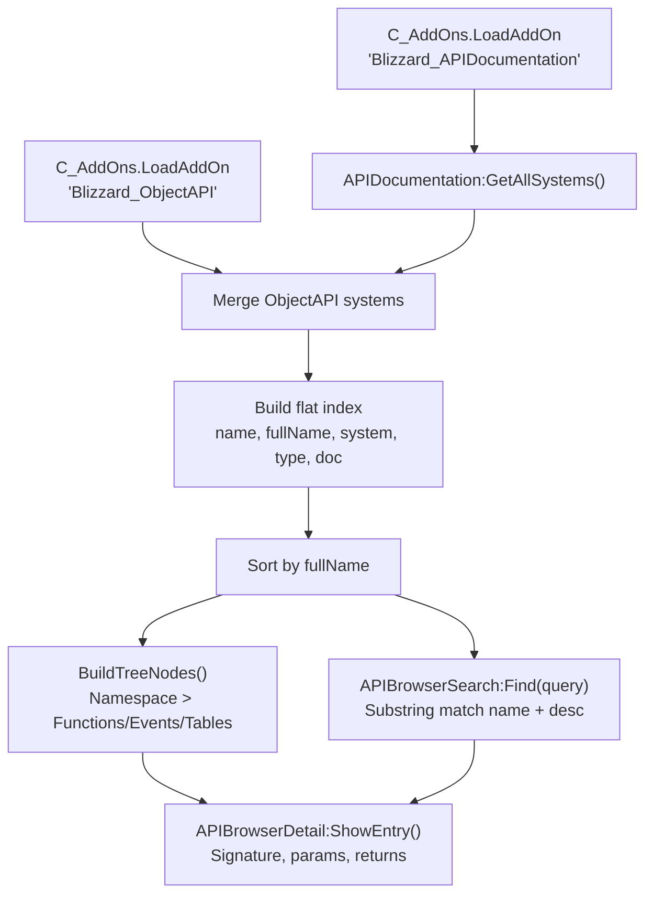

---

## WAImporter Pipeline

```mermaid
flowchart TD
    subgraph Decode["WADecode.lua"]
        INPUT["WA export string"]
        BASE64["LibDeflate:DecodeForPrint()"]
        DECOMP["LibDeflate:DecompressDeflate()"]
        DESER["LibSerialize:Deserialize()"]
        ANALYZE["AnalyzeAura()<br/>Normalize triggers, config,<br/>authorOptions, textures,<br/>conditions, custom code"]
    end

    subgraph CodeGen["WACodeGen.lua"]
        TOC["GenerateTOC()<br/>.toc manifest"]
        INIT["GenerateInit()<br/>SavedVars, load guards,<br/>per-aura frame code"]
        OPTS["GenerateOptions()<br/>Settings API controls"]
    end

    subgraph AuraTypes["Per-Aura Code Generation"]
        ICON["GenIconAura<br/>Frame + Texture + Cooldown"]
        BAR["GenAuraBarAura<br/>StatusBar + timer OnUpdate"]
        TEXT["GenTextAura<br/>FontString + dynamic text"]
        TEXTURE["GenTextureAura<br/>Frame + Texture + rotation"]
    end

    subgraph Shared["Shared Emitters"]
        ENV["EmitAuraEnv<br/>aura_env.config + DB overlay"]
        STUBS["EmitWAStubs<br/>WA API compatibility shim"]
        CUSTOM["EmitCustomCode<br/>init/onShow/onHide"]
        TRIG["GenTriggerCode<br/>aura2/status/custom/event"]
        ONUPD["EmitCustomTriggerOnUpdate<br/>Throttled polling + cursor follow"]
        COND["BuildConditionLines<br/>Color/fontSize conditions"]
        TEXCALL["TextureCall<br/>Atlas vs path + WA texture subs"]
    end

    subgraph Options["Options Generation"]
        SLIDER["EmitRangeOption<br/>Settings.CreateSlider"]
        TOGGLE["EmitToggleOption<br/>Settings.CreateCheckbox"]
        SELECT["EmitSelectOption<br/>Settings.CreateDropdown"]
        COLOR["EmitColorEditor<br/>Standalone floating panel"]
        DESC["EmitDescriptionOption<br/>Section headers"]
    end

    INPUT --> BASE64 --> DECOMP --> DESER --> ANALYZE
    ANALYZE --> TOC
    ANALYZE --> INIT
    ANALYZE --> OPTS

    INIT --> AuraTypes
    AuraTypes --> Shared

    OPTS --> Options

    style Decode fill:#1e2a3a,stroke:#4a6a8a
    style CodeGen fill:#1e2a3a,stroke:#4a6a8a
```

### WAImporter aura_env & Config Flow

```
WA authorOptions (decoded)
    |
    v
ExtractAuthorOptions()       -- normalize to {type, key, name, default, ...}
ExtractConfig()              -- raw config key/value pairs (incl. table values)
    |
    v
CollectConfigDefaults()      -- merge authorOptions defaults + raw config fallback
    |
    v
GenerateInit():
    db.config.key = default   -- per-key if-nil initialization in SavedVariables
    aura_env.config = {...}   -- baked defaults inside each aura's do-block
    db.config overlay         -- for k,v in pairs(db.config) do aura_env.config[k] = v end
    |
    v
GenerateOptions():
    Settings API controls     -- range/toggle/select bind to db.config[key]
    Color editor panel        -- standalone BackdropTemplate frame with swatches
    ns.RefreshConfig()        -- no-op stub; config changes require /reload
```

### WA Texture Substitution

| WA Bundled Texture      | Substitution                          |
|-------------------------|---------------------------------------|
| `Circle_Smooth2`        | `Interface\COMMON\Indicator-Gray`     |
| `Circle_Smooth`         | `Interface\COMMON\Indicator-Gray`     |
| `Square_White`          | `Interface\BUTTONS\WHITE8X8`          |
| (unknown WA texture)    | `INV_Misc_QuestionMark` + TODO comment|

---

## Event Monitor Architecture

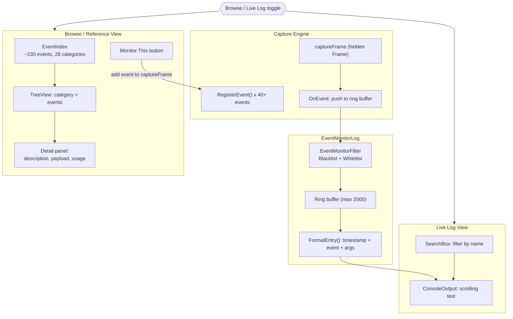

---

## Snippet Editor Data Model

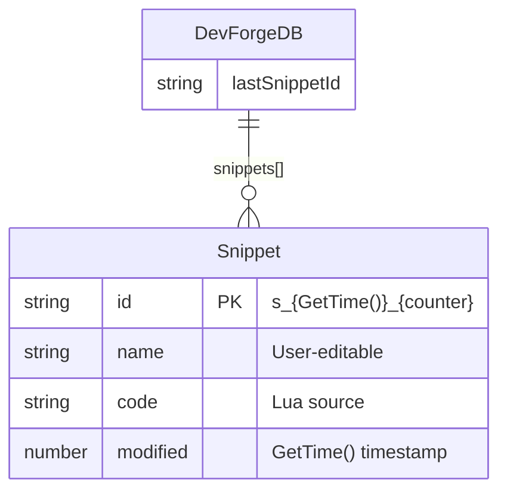

```mermaid
flowchart LR
    subgraph Store["SnippetStore (data layer)"]
        CREATE["Create(name)"]
        SAVE["Save(id, name, code)"]
        DELETE["Delete(id)"]
        DUP["Duplicate(id)"]
        GETALL["GetAll() sorted by modified"]
    end

    subgraph Templates["Template System"]
        TDATA["TemplateData<br/>Built-in addon templates"]
        TBROWSE["TemplateBrowser<br/>Category tree + preview"]
        FBUILDER["FrameBuilder<br/>Visual frame code gen"]
        SCAFFOLD["AddonScaffold<br/>Full addon project gen"]
    end

    subgraph UI["SnippetEditor UI"]
        LIST["SnippetList<br/>Left panel"]
        NAME["Name EditBox"]
        CODE["CodeEditBox<br/>Multi-line"]
        OUTPUT["Bottom panel output"]
        RUN["Run button"]
    end

    LIST -->|click| SAVE
    LIST -->|click| UI
    RUN --> SAVE
    RUN -->|ConsoleExec:Execute()| OUTPUT
    CREATE --> LIST
    DELETE --> LIST
    DUP --> LIST
    TBROWSE -->|"insert template"| CODE
    FBUILDER -->|"insert frame code"| CODE
    SCAFFOLD -->|"generate project"| CPD["CopyDialog"]
```

---

## UI Frame Hierarchy

```mermaid
graph TD
    UI["UIParent"]
    MW["DevForgeMainWindow<br/>HIGH strata, BackdropTemplate"]
    TITLE["Title Bar<br/>Drag to move"]
    CLOSE["Close Button"]
    RESIZE["Resize Grip<br/>Bottom-right"]
    ACTBAR["ActivityBar<br/>Vertical icon strip (left edge)"]
    SIDEBAR["Sidebar<br/>Module list panel"]
    BOTTOM["BottomPanel<br/>Output + Problems tabs"]
    CONTENT["Content Area"]

    UI --> MW
    MW --> TITLE
    MW --> CLOSE
    MW --> RESIZE
    MW --> ACTBAR
    MW --> SIDEBAR
    MW --> BOTTOM
    MW --> CONTENT

    ACTBAR --> A1["Console"]
    ACTBAR --> A2["Inspector"]
    ACTBAR --> A3["API Browser"]
    ACTBAR --> A4["Tables"]
    ACTBAR --> A5["CVars"]
    ACTBAR --> A6["Editor"]
    ACTBAR --> A7["Events"]
    ACTBAR --> A8["Perf"]
    ACTBAR --> A9["Macros"]
    ACTBAR --> A10["Textures"]
    ACTBAR --> A11["Errors"]

    CONTENT --> |"active module.frame"| MOD["Module Frame<br/>(SetAllPoints content)"]

    style MW fill:#1e1e24,stroke:#666
    style CONTENT fill:#1e1e24,stroke:#444
```

---

## Widget Composition Patterns

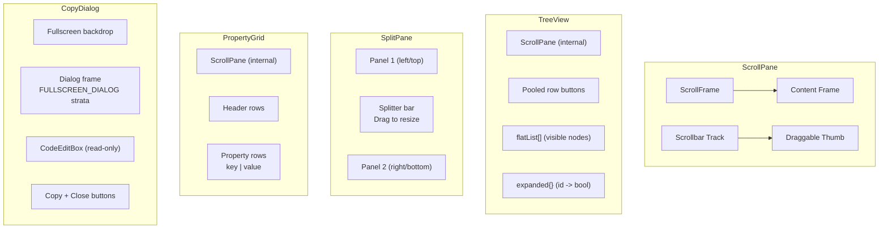

---

## EventBus & IntegrationBus Message Flow

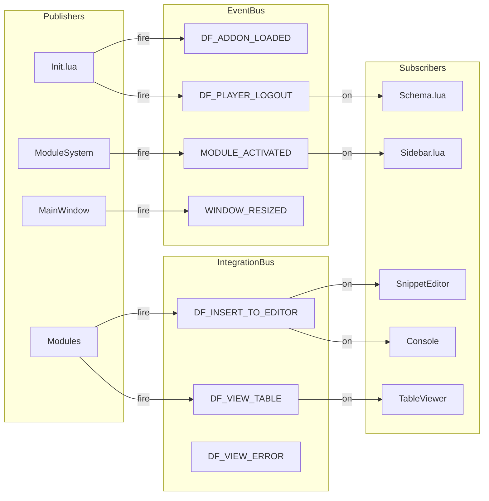

---

## SavedVariables Lifecycle

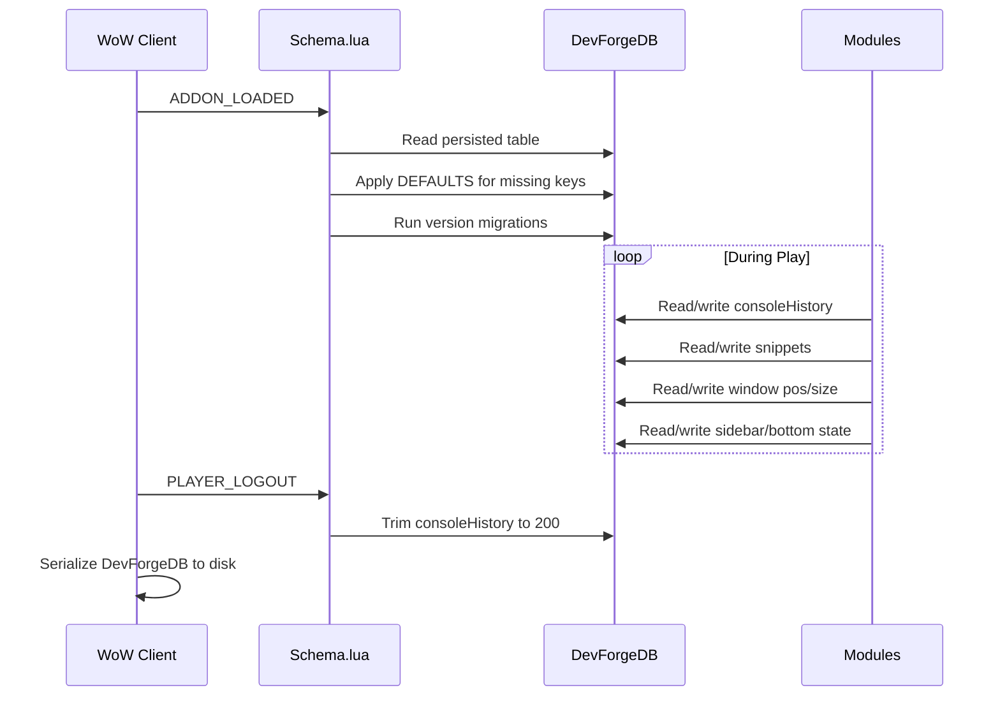

---

## Slash Command Router

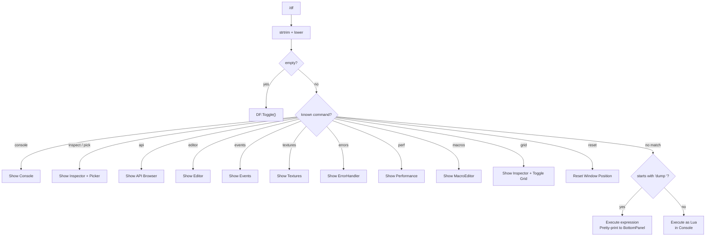

### Additional Slash Aliases

| Command   | Target              |
|-----------|---------------------|
| `/dl`     | Show ErrorHandler   |
| `/apii`   | Show API Browser    |
| `/lua`    | Show Console (optional inline code) |

---

## Error Handling Strategy

```
Layer             Guard                        Behavior
---------------------------------------------------------------------------
WoW API calls     pcall() everywhere           Return nil + error string
Secret values     issecretvalue() + pcall       Display [secret] in red
Frame properties  SecretGuard:SafeGet()         Graceful [error] display
Event callbacks   EventBus pcall per handler    Log to DF.ErrorLog, continue
User code exec    loadstring + pcall            Show error in Console output
Print hijacking   Outer pcall + always-restore  Never leaves print broken
Module creation   pcall(factory)                Print error, skip module
Addon loading     pcall(LoadAddOn)              Show fallback message
Grid drawing      Loop cap (4000 lines)         Prevent infinite loops
Resize handlers   Width > 0 guards              Skip layout on zero-size
Font creation     _G lookup before CreateFont   Survives /reload
Lua errors        seterrorhandler hook           Capture to ErrorHandler module
```

### ErrorHandler Module

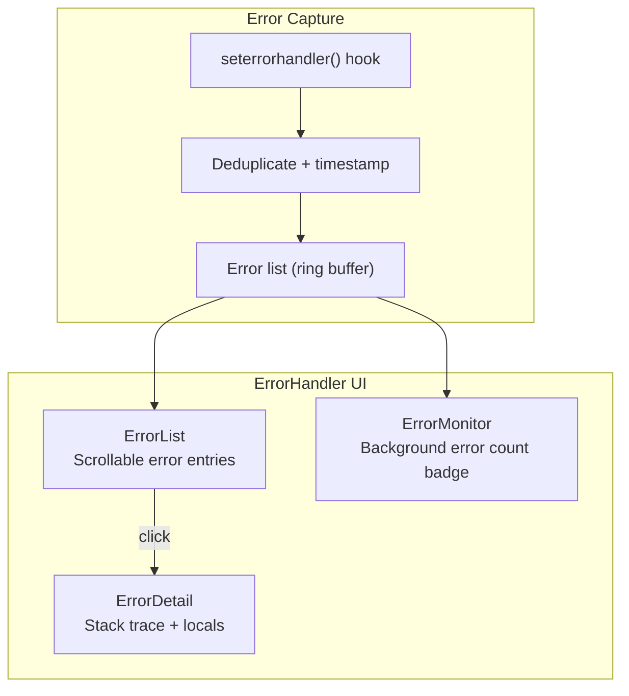

---

## File Map

```
DevForge/                          (76 files, ~26,000 lines)
  DevForge.toc                     TOC manifest + load order

  Libs/                            Bundled libraries (3 files)
    LibStub/
      LibStub.lua                  Standard WoW library loader
    LibDeflate/
      LibDeflate.lua               Compression (for WA import)
    LibSerialize/
      LibSerialize.lua             Serialization (for WA import)

  Core/                            Foundation (7 files)
    Constants.lua                  Colors, fonts, layout dimensions
    Init.lua                       Boot, slash commands, addon compartment
    SecretGuard.lua                12.x secret value wrappers
    Util.lua                       String helpers, PrettyPrint, Debounce
    EventBus.lua                   Internal pub/sub with error logging
    ModuleSystem.lua               Lazy module registry + tab activation
    IntegrationBus.lua             Cross-module actions (insert, view table)

  SavedVariables/                  Persistence (1 file)
    Schema.lua                     Defaults, migrations, logout trim

  UI/                              Framework (15 files)
    Theme.lua                      Backdrop helpers, font cache
    ActivityBar.lua                Vertical icon strip (left edge)
    Sidebar.lua                    Module list / navigation panel
    BottomPanel.lua                Shared Output + Problems tabs
    MainWindow.lua                 HIGH frame, drag, resize, ESC close
    Widgets/
      Button.lua                   Dark styled button
      ScrollPane.lua               ScrollFrame + thumb scrollbar
      SearchBox.lua                EditBox + placeholder + debounce
      CodeEditBox.lua              Multi-line code input with Tab=4spaces
      TreeView.lua                 Virtual-scroll expandable tree
      PropertyGrid.lua             Two-column sectioned key/value
      SplitPane.lua                Resizable horizontal/vertical split
      DropDown.lua                 Context menu (no UIDropDownMenu)
      CopyDialog.lua               Fullscreen copy-to-clipboard dialog

  Modules/ErrorHandler/            Error capture (4 files)
    ErrorHandler.lua               Orchestrator, seterrorhandler hook
    ErrorList.lua                  Scrollable error entry list
    ErrorDetail.lua                Stack trace + context display
    ErrorMonitor.lua               Background error count badge

  Modules/Console/                 Lua REPL (5 files)
    ConsoleHistory.lua             Ring buffer, Up/Down, persistence
    ConsoleExec.lua                loadstring + pcall, print capture
    ConsoleOutput.lua              Scrollable colored output
    ConsoleInput.lua               Input line with prompt
    Console.lua                    Orchestrator

  Modules/Inspector/               Frame Inspector (6 files)
    InspectorHighlight.lua         Blue overlay rectangle
    InspectorPicker.lua            Fullscreen pick via GetMouseFocus
    InspectorTree.lua              Parent/child hierarchy builder
    InspectorProps.lua             Property sections (6 groups)
    InspectorGrid.lua              Pixel grid + frame guide lines
    Inspector.lua                  Orchestrator

  Modules/APIBrowser/              API Reference (5 files)
    APIBrowserData.lua             Load Blizzard docs + ObjectAPI
    APIBrowserSearch.lua           Substring search across all entries
    APIBrowserList.lua             Namespace tree + search box
    APIBrowserDetail.lua           Signature, params, returns display
    APIBrowser.lua                 Orchestrator

  Modules/TableViewer/             Deep table inspector (2 files)
    TableDump.lua                  Recursive table serialization
    TableViewer.lua                Tree-based table browser

  Modules/CVarViewer/              CVar browser (2 files)
    CVarData.lua                   CVar metadata + categories
    CVarViewer.lua                 Searchable CVar list + detail

  Modules/SnippetEditor/           Code Snippets (7 files)
    SnippetStore.lua               CRUD for persistent snippets
    SnippetList.lua                Scrollable snippet name list
    TemplateData.lua               Built-in addon code templates
    TemplateBrowser.lua            Category tree + template preview
    FrameBuilder.lua               Visual frame code generator
    AddonScaffold.lua              Full addon project generator
    SnippetEditor.lua              Orchestrator with Run/Save/Delete

  Modules/WAImporter/              WeakAuras converter (3 files)
    WADecode.lua                   Decode + analyze WA export strings
    WACodeGen.lua                  Generate standalone addon from analysis
    WAImporter.lua                 Import dialog UI

  Modules/EventMonitor/            Event Tools (4 files)
    EventMonitorLog.lua            Ring buffer + blacklist/whitelist
    EventIndex.lua                 230 events, 28 categories, search
    EventMonitorFilter.lua         Filter configuration UI
    EventMonitor.lua               Live log + Browse reference

  Modules/Performance/             Addon profiling (3 files)
    PerfData.lua                   GetAddOnCPUUsage / memory collection
    PerfTable.lua                  Sortable addon performance table
    PerfMonitor.lua                Orchestrator

  Modules/MacroEditor/             Macro management (3 files)
    MacroStore.lua                 Macro CRUD via WoW macro API
    MacroList.lua                  Scrollable macro list
    MacroEditor.lua                Orchestrator with icon picker

  Modules/TextureBrowser/          Asset Browser (5 files)
    TextureAtlasData.lua           Atlas name database (~469 KB)
    TextureIconData.lua            Icon path database
    TextureRuntime.lua             Runtime texture lookup helpers
    TextureIndex.lua               Categorized texture paths + atlas
    TextureBrowser.lua             Grid preview with size toggle
```
